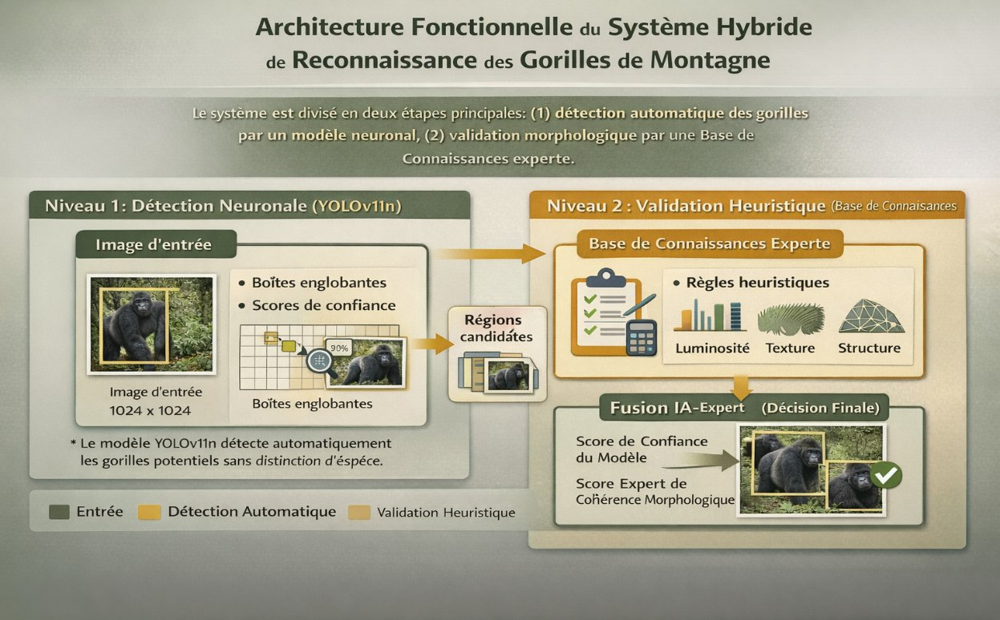
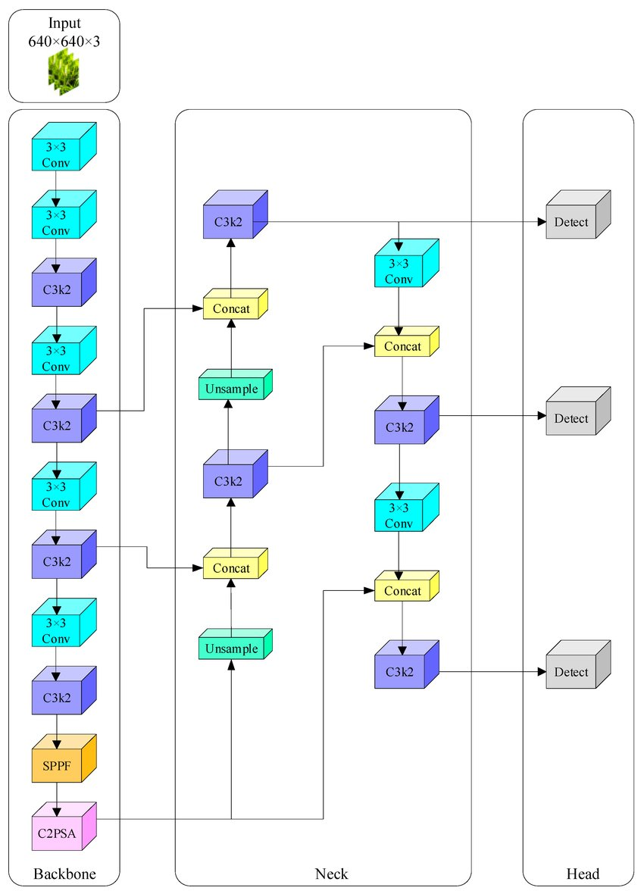
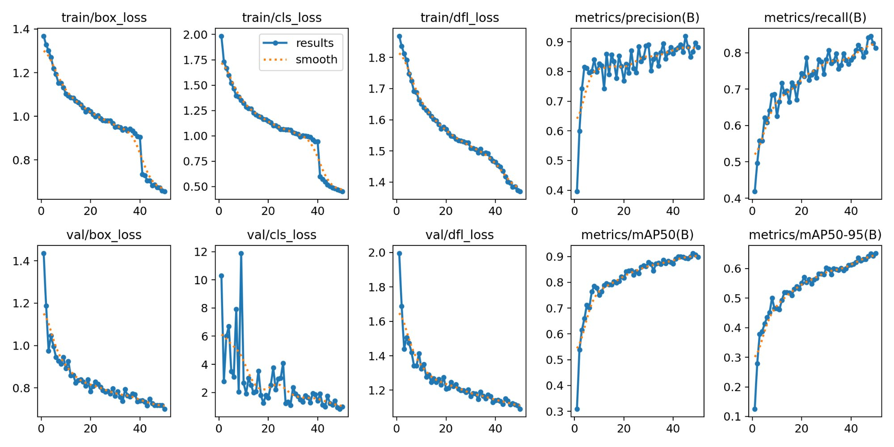
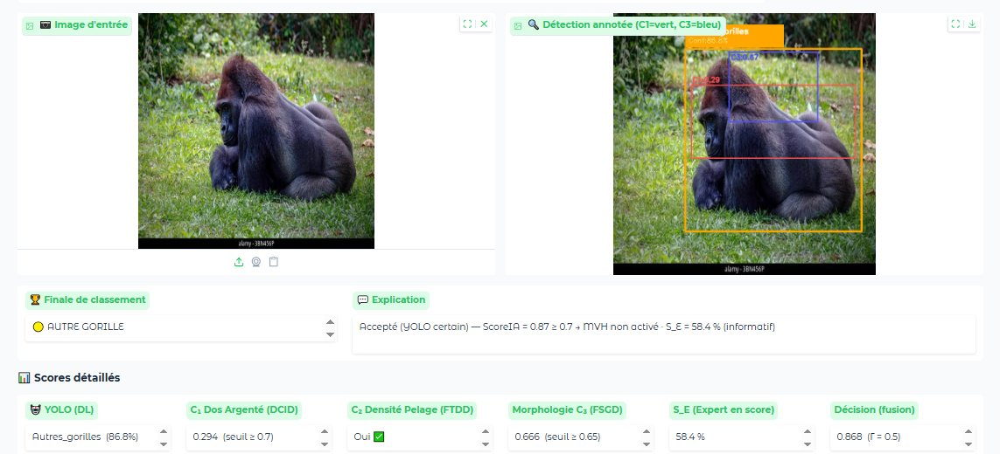
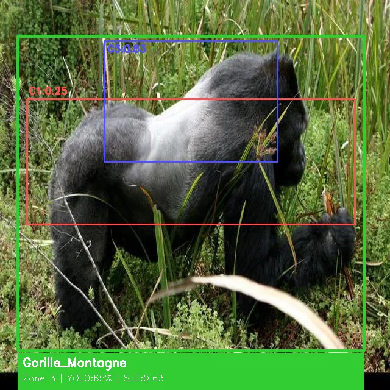
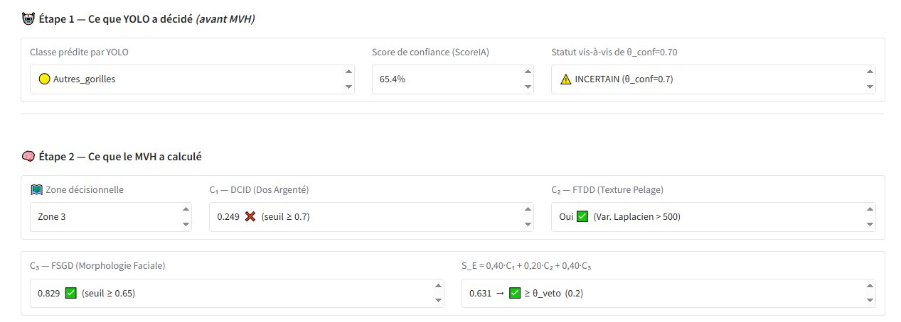
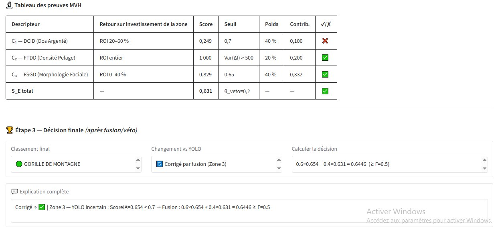

# 🦍 Détection hybride des gorilles de montagne

<div align="center">


**Système hybride YOLOv11n + Module de Validation Heuristique (MVH)**  
pour la détection fiable et explicable des gorilles de montagne en temps réel

[🚀 Démarrage rapide](#-démarrage-rapide) •
[📊 Résultats](#-résultats) •
[🏗️ Architecture](#️-architecture) •
[🖥️ Interface Gradio](#️-interface-gradio) •
[📖 Article](#-article-scientifique) •
[📧 Contact](#-contact)

</div>

---

## 📌 Présentation

Ce projet propose un système hybride de détection des **gorilles de montagne**
(*Gorilla beringei beringei*) combinant :

- 🧠 **YOLOv11n** — détecteur neuronal rapide pour la localisation temps réel
- 🔬 **Module de Validation Heuristique (MVH)** — 3 descripteurs morphologiques
  interprétables fondés sur les traits taxonomiques de l'espèce
- 🎛️ **Interface Gradio** — visualisation interactive des décisions avec
  explication détaillée (C₁, C₂, C₃, S_E, zone activée)

Le système réduit les **faux positifs de 74 %** (27 → 7) à **107 FPS**,
avec une décision entièrement traçable — indispensable pour les protocoles
de conservation.

---

## 🏗️ Architecture

<div align="center">



*Architecture fonctionnelle — Niveau 1 : détection neuronale (YOLOv11n) · Niveau 2 : validation heuristique (MVH)*

</div>

### Pipeline décisionnel

```
Image d'entrée
      │
      ▼
┌─────────────────────┐
│      YOLOv11n       │
│  Localisation +     │
│  ScoreIA ∈ [0,1]   │
└──────────┬──────────┘
           │
     ┌─────▼──────────────┐
     │  ScoreIA ≥ 0.70 ?  │
     └──┬─────────────────┘
        │                │
       OUI              NON
        │                │
  ┌─────▼──────┐   ┌─────▼──────────────────────┐
  │  S_E≥0.20 ?│   │        ZONE 3              │
  └──┬──┬──────┘   │  Fusion tardive            │
     │  │          │  0.60·ScoreIA + 0.40·S_E   │
   OUI NON         └────────────────────────────┘
     │   │
     │  ZONE 2 ── Véto MVH → Autres_Gorilles
     │
  ZONE 1 ── YOLO décide directement
```

### Architecture YOLOv11n

<div align="center">



*Backbone C3k2 · Neck PANet · Tête anchor-free · Entrée 640×640×3*

</div>

### Les 3 descripteurs MVH

| Descripteur | Zone ROI | Trait ciblé | Formule | Seuil |
|---|---|---|---|---|
| **C₁ DCID** | 20–60 % hauteur | Dos argenté | `0.4·(L̄/255) + 0.4·Rb + 0.2·(σL/255)` | ≥ 0,70 |
| **C₂ FTDD** | ROI entière | Densité texture pelage | `Var(ΔI) > 500` | Binaire |
| **C₃ FSGD** | 0–40 % hauteur | Géométrie faciale | `min(1, 2·ρedges + 0.5·Rd)` | ≥ 0,65 |

**Score d'expertise : S_E = 0,40·C₁ + 0,20·C₂ + 0,40·C₃**

---

## 📊 Résultats

### Comparaison multi-détecteurs

| Système | Précision | Rappel | F1-score | Faux positifs | Vitesse |
|---|---|---|---|---|---|
| Faster-RCNN | 79,2 % | 91,8 % | 85,0 % | 34 | — |
| RetinaNet | 81,7 % | 93,1 % | 87,0 % | 30 | — |
| DETR | 80,4 % | 89,6 % | 84,7 % | 33 | — |
| YOLOv8 | 82,1 % | 93,6 % | 87,5 % | 29 | — |
| YOLOv11n seul | 83,4 % | 94,4 % | 88,6 % | 27 | 139 FPS |
| **Hybride (YOLOv11n + MVH)** | **95,0 %** | **92,4 %** | **93,7 %** | **7 (−74 %)** | **107 FPS** |

> Évaluation sur 638 images hold-out · GPU Tesla T4 · IC 95 % : P = 95,0±1,8 %

### Courbes d'entraînement YOLOv11n

<div align="center">



*50 epochs · GPU Tesla T4 · Convergence sans surapprentissage*

</div>

### Matrice de confusion

<div align="center">



*Matrice de confusion du système hybride — FP réduits de 27 → 7 (−74 %)*

</div>

### Étude d'ablation

| Configuration | Précision | Rappel | F1 | ΔFP |
|---|---|---|---|---|
| YOLO seul | 83,4 % | 94,4 % | 88,6 % | — |
| + C₁ seul (DCID) | 87,1 % | 94,0 % | 90,4 % | −8 |
| + C₂ seul (FTDD) | 84,9 % | 93,7 % | 89,1 % | −3 |
| + C₃ seul (FSGD) | 86,3 % | 93,9 % | 89,9 % | −6 |
| + C₁ + C₃ | 91,3 % | 93,2 % | 92,2 % | −14 |
| **Système complet** | **95,0 %** | **92,4 %** | **93,7 %** | **−20** |

---

## 🖥️ Interface Gradio

### Détection annotée — Gorille de montagne (Zone 3)

<div align="center">



*Zones ROI annotées : C₁ (rouge) · C₃ (bleu) · Zone 3 | YOLO:65% | S_E:0.63 → Gorille_Montagne*

</div>

### Étapes MVH — Calcul des descripteurs

<div align="center">



*Étape 1 : décision YOLO · Étape 2 : calcul C₁, C₂, C₃ et score S_E*

</div>

### Résultat final et explication

<div align="center">



*Affichage du résultat final avec justification complète de la décision*

</div>

---

## 🚀 Démarrage rapide

### Prérequis

- Python 3.9+
- GPU recommandé (CUDA) — fonctionne aussi sur CPU

### Installation

```bash
# Cloner le dépôt
git clone https://github.com/hermankandolo/gorille-montagne-detection-hybride
cd gorille-montagne-detection-hybride

# Installer les dépendances
pip install -r requirements.txt
```

### Lancer l'interface Gradio

```bash
python app.py
```

Ouvrez votre navigateur sur `http://localhost:7860`

### Google Colab

[](https://colab.research.google.com/github/hermankandolo/gorille-montagne-detection-hybride/blob/main/gorilla_expert_colab.ipynb)

---

## 📁 Structure du projet

```
gorille-montagne-detection-hybride/
│
├── 📄 app.py                        # Interface Gradio principale
│
├── 📦 mvh/
│   ├── descripteurs.py              # C₁ DCID, C₂ FTDD, C₃ FSGD
│   ├── fusion.py                    # Logique Zone 1 / Zone 2 / Zone 3
│   └── base_connaissances.py        # Score S_E + seuils
│
├── 📦 yolo/
│   └── detection.py                 # Wrapper YOLOv11n
│
├── 📂 models/
│   └── best_model.pt                # Poids YOLOv11n entraînés
│
├── 📂 images/                       # Images du README
│   ├── ARchiHybride.png
│   ├── Architectureyolo11.png
│   ├── Matrice.png
│   ├── training_curves.png
│   ├── detection_gorille_montagne.webp
│   ├── gradio_etapes_mvh.png
│   └── gradio_resultat_final.png
│
├── 📓 gorilla_expert_colab.ipynb    # Notebook Google Colab
├── 📋 requirements.txt
├── ⚙️  config.yaml                  # Seuils et paramètres MVH
└── 📖 README.md
```

---

## ⚙️ Configuration

Les paramètres sont dans `config.yaml` :

```yaml
# Seuils de décision
theta_conf: 0.70       # Porte de confiance YOLO
theta_veto: 0.20       # Seuil véto MVH (Zone 2)
gamma: 0.50            # Seuil fusion (Zone 3)
alpha: 0.60            # Poids ScoreIA dans la fusion

# Descripteurs MVH
c1_threshold: 0.70     # Dos argenté
c2_threshold: 500      # Variance Laplacien
c3_threshold: 0.65     # Géométrie faciale

# Poids S_E
w1: 0.40   # Poids C₁
w2: 0.20   # Poids C₂
w3: 0.40   # Poids C₃
```

---

## 📖 Article scientifique

Ce code accompagne l'article soumis en conférence IEEE :

> **Validation morphologique à porte de confiance pour la détection fiable
> des gorilles de montagne dans les images de pièges photographiques**
>
> KANDOLO Herman · International School, VNU, Hanoi, Vietnam

---

## 🗂️ Jeu de données

- **3 190 images** annotées manuellement via Roboflow
- 2 classes : `Mountain_Gorilla` / `Other_Gorilla`
- Sources : pièges photographiques (Virunga, Bwindi), caméras fixes, collections académiques
- Répartition : 70 % entraînement / 10 % validation / 20 % test

> Le jeu de données n'est pas distribué publiquement en raison de restrictions
> de conservation. Contactez l'auteur pour un accès académique.

---

## 📜 Licence

Ce projet est distribué sous licence **MIT**.

---

## 📧 Contact

**KANDOLO Herman** · International School, VNU — Hanoi, Vietnam  
hermankandolo2022@gmail.com · [@hermankandolo](https://github.com/hermankandolo)

---

<div align="center">

⭐ Si ce projet vous est utile, pensez à lui donner une étoile !

</div>
